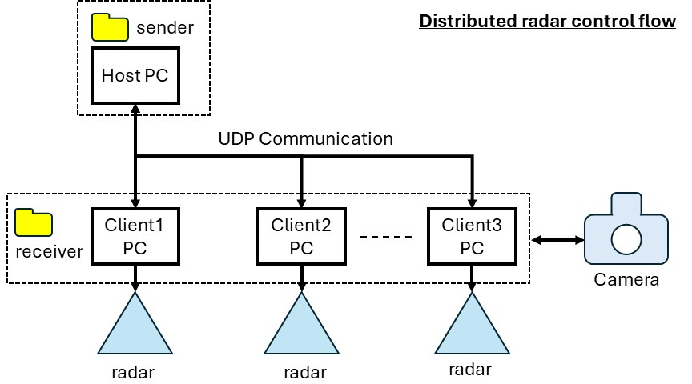
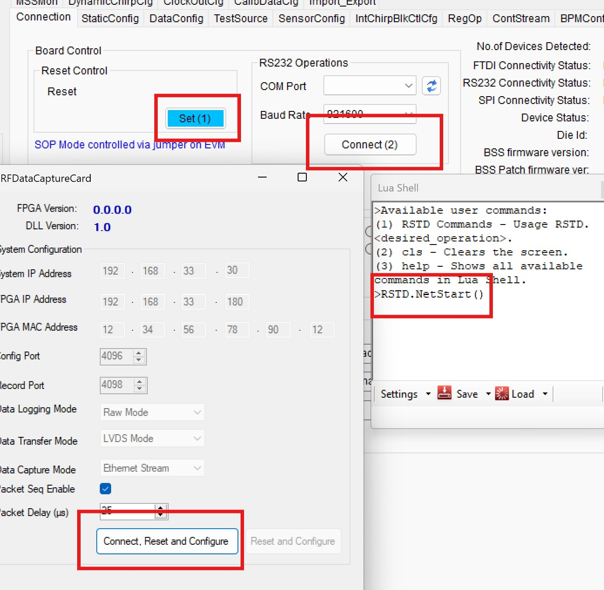
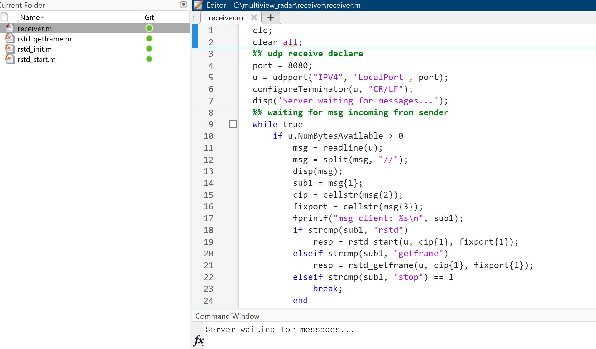
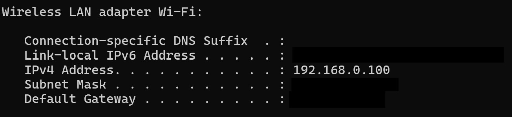
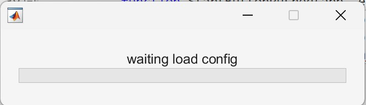

## Distributed Ti radar over UDP
This MATLAB framework is used for communication with multiple millimeter wave studios simultaneously via UDP. **However**, it does not achieve perfect synchronization due to the use of software triggers, resulting in frame shifts of approximately one frame or less at a 30 fps setting.

<br/>
**Fig 1** Ilustration of control flow

### Installation and requirement
```bash 
    git clone https://github.com/shikuzen multiview-radar.git
    
    for host pc > use only /sender folder
    for client pc > use only /receiver folder
    **require MATLAB for both host and client
    **require mmwave-studio for every client
```
### Project tree
```bash
multiview/
├── sender/
│   ├── multiview_app.mlapp
│   ├── ipread.m
│   ├── connect.m
│   ├── start.m   
├── receiver/
│   ├── receiver.m
│   ├── rstd_init.m < **radar config parameters**
│   ├── rstd_start.m
│   └── rstd_getframe.m
├── camera_.py
└── README.md
```
### How to use (step-by-step)

for receiver (client pc)
1. Download the receiver folder to client pc.
2. Open mmWaveStudio, click reset, and connect to your radar device. Then, verify the DCA1000 connection. In the Lua shell, type "RSTD.NetStart()".
<br/>
3. Open MATLAB, navigate to the receiver folder, and run **receiver.m**.
<br/>

for sender (host pc)

4. Download the sender folder to the host PC.
5. Navigate to sender folder using MATLAB, and run **multiview_app.mlpp** file.
<br/>
6. Fill IP and port from a  client PC (default port is "8080") [**you can change port in receiver.m file in a client pc**].
<br/>
7. Click connect, and wait until waitbar disappear.
<br/>
8. Start for record the radar frame.

### **Extra (for camera)
If you want to record the camera at the same time with radar, you can connect the radar to a client PC. Then, change the IP and port in **camera_.py**, setting the IP to the client's IP address and ensuring the port is different from the radar's port.

### **NOTE
The software is still under development. If you encounter any bugs, please feel free to contact me [email: N.Kumchaiseemak@tudelft.nl]